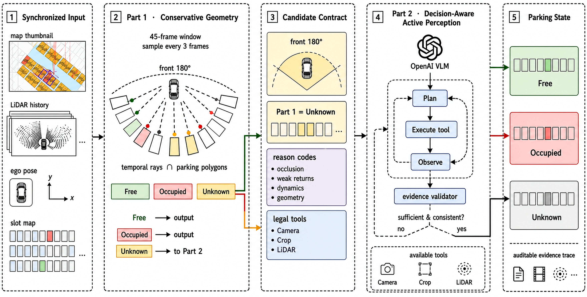

# DASP-Park

**Decision-Aware Active Semantic Perception for Reliable Parking-Slot Occupancy under Occlusion**



DASP-Park is a research implementation for evidence-grounded parking-slot
occupancy reasoning. It combines causal, map-aligned LiDAR geometry with a
bounded multimodal Plan–Execute–Observe agent. The system predicts
`free`, `occupied`, or `unknown`; uncertainty is preserved when the target is
occluded, weakly observed, contaminated by static structures, or cannot be
assigned to the correct mapped slot.

The repository contains the current research code, tests, configuration
templates, and the manuscript. Raw sensor sequences, annotations, experiment
outputs, model traces, and model weights are intentionally not included.

## Method

1. **Part 1 — causal geometric triage.** Historical LiDAR returns are aligned
   in the map frame. Ray traversal supplies positive free-space evidence;
   target-owned, vehicle-like support supplies occupied evidence. Static
   structure, boundary ownership, adjacent-slot overlap, and pose sensitivity
   act as vetoes.
2. **Candidate routing.** Only unresolved slots within 18 m and the forward
   180° driving half-plane enter Part 2. Camera feasibility is checked
   geometrically and controls tool availability, not occupancy.
3. **Part 2 — active perception.** A center VLM receives the Part 1 reason and
   legal tools, then autonomously requests camera context, a target crop, or
   target-local LiDAR.
4. **Evidence-gated commitment.** A deterministic validator accepts a final
   state only when the cited evidence was observed, the modality contract is
   satisfied, and confidence reaches the configured threshold. Otherwise the
   system re-plans or returns `unknown`.

## Developmental frame-6241 result

The paper's locked experiment contains 14 human-labelled slots (6 free,
2 occupied, 6 unknown). These are single-anchor developmental results, not a
route-disjoint benchmark.

| Method | 14-GT accuracy | Terminal coverage | Selective accuracy | Unknown false resolution |
|---|---:|---:|---:|---:|
| Part 1, W=45 / K=3 | 50.00% | 7.14% | 100.00% | 0.00% |
| DASP-Park full | **92.86%** | **64.29%** | 88.89% | 16.67% |

The complete 16-setting history ablation and local-VLM comparison are reported
in the manuscript. The locked GT, prompts, traces, and sensor data remain
outside this source-only release.

## Repository layout

```text
parking_pose_correction/   pose synchronization and SE(2) correction
parking_slot_box_scoring/  slot-constrained obstacle hypotheses
parking_slot_hybrid_3d/    Part 1 temporal geometry and three-state evidence
parking_slot_part2/        evidence catalog, tools, orchestration, replay
parking_slot_agent_v2/     camera-first agent and deterministic validator
parking_slot_validation/   locked-label models and evaluation metrics
scripts/                   experiment, audit, report, and figure entry points
tests/                     unit, synthetic, contract, and replay tests
configs/                   model/runtime configuration templates
paper/                     LaTeX, bibliography, figures, and compiled paper
```

## Install and test

```bash
python3 -m venv .venv
source .venv/bin/activate
python -m pip install -U pip
python -m pip install -e ".[dev]"
pytest -q
```

The core implementation is provider-neutral. Install the OpenAI adapter only
when it is needed:

```bash
python -m pip install -e ".[openai]"
```

No API key, credential file, dataset path, or model weight is committed.

## Rebuild the scientific artifacts

Figure builders are retained under `scripts/`. Qualitative figures require
the external sensor and annotation artifacts used in the paper:

```bash
python scripts/build_parkingagent_multicase_figure.py
```

Compile the manuscript with a local Tectonic installation:

```bash
cd paper
tectonic parkingagent.tex --keep-logs
```

The released manuscript is
[`paper/DASP-Park_Decision-Aware_Active_Semantic_Perception.pdf`](paper/DASP-Park_Decision-Aware_Active_Semantic_Perception.pdf).

## Data contract

A full run expects synchronized LiDAR and left-camera records, corrected
map-frame poses, camera calibration, and a mapped slot database. Keep those
artifacts outside the repository and pass their locations explicitly to the
relevant CLI. Ground truth is joined only by the offline evaluator and must not
be present in an inference request.

## Scope

The current paper reports one locked decision anchor and a small visible
subset. It demonstrates the architecture and exposes its remaining failure
mode, but it does not establish parking-lot-level generalization. See the
manuscript for limitations and the planned route-disjoint evaluation.
